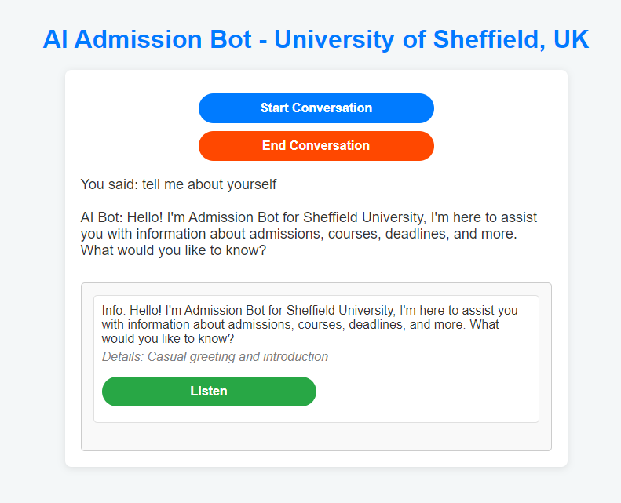

# Admission Voice Bot

## Overview
The Admission Voice Bot is a Flask-based web application designed to assist prospective students with admission-related queries using natural language processing (NLP) techniques. The bot employs a machine learning model to understand user queries and retrieve relevant responses from a pre-defined dataset.

## Flow
1. **User Interaction**: The user initiates a conversation by clicking the "Start Conversation" button, prompting the bot to greet and listen for queries using the Web Speech API.
2. **Query Processing**: The spoken query is converted to text and sent to the Flask backend.
3. **Query Retrieval**: The backend retrieves similar admission queries using the FAISS index and returns the most relevant responses.
4. **Response Output**: The bot presents the response back to the user, and the user can listen to the response via a text-to-speech feature.
5. **Language Support**: The bot detects the language of the query and translates it if necessary before processing.

## Tech Stack
- **Frontend**: HTML, CSS, JavaScript, Flask for rendering templates
- **Backend**: Flask framework, pandas for data manipulation, NumPy for numerical operations
- **Machine Learning**: Sentence Transformers for encoding queries, FAISS for efficient similarity search
- **Translation**: Google Translator API for language detection and translation

## LLMs (Large Language Models)
The application utilizes the **paraphrase-MiniLM-L6-v2** model from the Sentence Transformers library for semantic understanding and query matching. This model is optimized for generating sentence embeddings, allowing for effective similarity comparisons of user queries with the dataset.

## Data
- The application uses a dataset of admission queries and responses stored in a CSV file (`admission_queries_responses3.csv`).
- The queries are cleaned and processed to create embeddings, which are saved as a NumPy array (`admission_query_embeddings.npy`) for efficient retrieval.
- FAISS is used to create an index (`admission_faiss.index`) for fast similarity searches.

## Getting Started
1. Clone the repository:
   ```bash
   git clone https://github.com/rasikhali/admission-voice-bot.git
   cd admission-voice-bot
   ```
2. Install the required dependencies:
   ```bash
   pip install -r requirements.txt
   ```
3. Run the application:
   ```bash
   python admissionbotapp.py
   ```
4. Open your web browser and navigate to http://localhost:5000 to access the Admission Voice Bot.

## Screenshot

